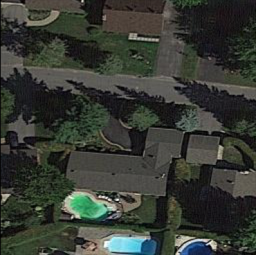
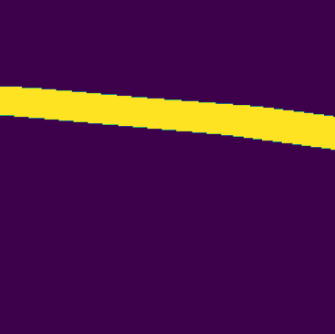
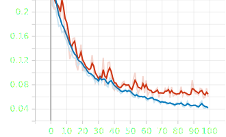
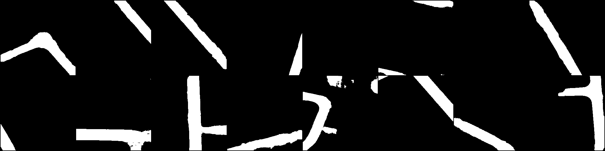
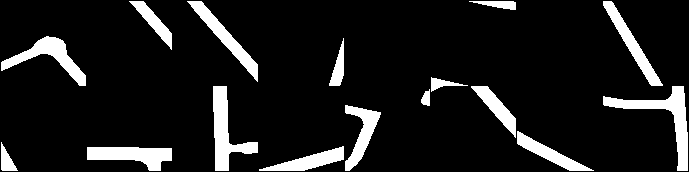

# Road Segementation using U-Net

 

## Overview

This repository contains the code for an Image Segmentation model using U-Net architecture to segment roads in the 'Ottawa dataset'. The goal of this project is to create accurate road masks for various images.

## Table of Contents

- [Prerequisites](#prerequisites)
- [Project Structure](#project-structure)
- [Installation](#installation)
- [Use](#use)
- [Results and Improvment](#results-and-improvment)
- [Contributing](#contributing)
- [License](#license)

## Prerequisites

Before you begin, ensure you have the following dependencies installed:

- Python 3.x
- PyTorch
- NumPy
- Matplotlib (for visualization)

You can install the required Python packages using `conda`: (/!\ This is a requirement file based from `osx-arm64`, it can be different if you are on other device architecture)

```bash
conda create --name <env> --file requirements.txt
```

## Project Structure

`saved_images/`: This directory contains example images and segmentation results from training.

In the more code side, the project is organized as follows, all file listed are under the `src` file:

`data_preprocessing.py`: This script handles data preprocessing such as patchify the original image into sub chunks:
```bash
python data_preprocessing.py
```

`config.py`: This configuration file controls both training and inference parameters. Customize it to suit your needs.

`train.py`: This script is used for training the U-Net model on the 'Ottawa dataset.' To start training, run:
```bash
python train.py
```

`test.py`: This script is used for testing the trained model. You can run it using:
```bash
python test.py
```

## Installation
Clone the repository:
```bash
git clone https://github.com/yourusername/ottawa-road-segmentation.git
cd ottawa-road-segmentation
```
Install the required packages as mentioned in the Prerequisites section.  
Download the [Ottawa dataset](https://github.com/yhlleo/RoadNet) and place it in a directory named `./Ottawa-Dataset`  
The Ottawa dataset come from this [paper](https://ieeexplore.ieee.org/document/8506600)

## Use
Before training, ensure you preprocess the dataset. Run the following command to perform data preprocessing:
```bash
python data_preprocessing.py
```
You should find the pre-processed dataset under `src/dataset` following this struct  
```angular2html
--train
 |--img
 |--mask
--valid
 |--img
 |--mask
```
Then to train the U-Net, execute the following command
```bash
python train.py
```
Make sure to personalize the training part by changing some parameter into the `config.py` file  
For the testing part, or inference, use
```bash
python test.py
```
## Results and Improvment

The result over 100 epochs are the following:

### Accuracy on valid set


### Dice Score on valid set


### Loss
   

The blue line here is the loss on training and le red line is the loss on valid 

### Result and comparaison Preds to Masks

This aim to a pretty decent result as we compare the masks:  
(First the predictions, then the thruth masks)

 

### Improvment

As we can see, this is pretty close to the mask, but still some noise around. And as the metric are not at 100%, we need to think how we could improve the model.  
#### Data
On a closer look on the data, on the original repo, they mention the separation between the training and testing set. At the end with the patches made while pre-process the data, we end up with approximativly 1600 training samples and 1000 valid sample. We could so, first, use some valid sample into the training set. Then, even if we add some, there is still not enought data to perfectly train a model fram scratch.
#### Model
The model use the simple U-Net from the paper, with only 4 depth layers. We could get into a depthest model, but we need to ensure that we need suffisant data for (Rely on point 1).
#### Conclusion
With all the key we have into our hand, two ways are open. Either gathering more data and label it, or use a pre-trained model as the encoding part.

## Contributing
Contributions are welcome! If you have any suggestions, improvements, or find issues, please create a new issue or a pull request.

## License
This project is licensed under the MIT License - see the LICENSE file for details.
